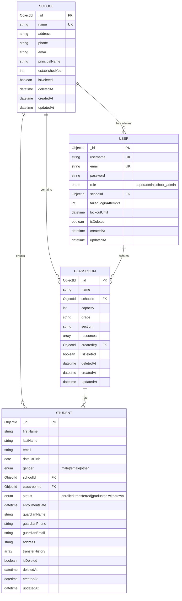

# School Management System API

A RESTful API for managing schools, classrooms, and students built with the Axion Node.js framework, MongoDB, and Redis.

## Live API

**Production URL:** https://soar-school-management-api.ajadionicode.com

| Endpoint | Description |
|----------|-------------|
| [/api-docs](https://soar-school-management-api.ajadionicode.com/api-docs) | Interactive Swagger UI Documentation |
| [/health](https://soar-school-management-api.ajadionicode.com/health) | Health check endpoint |

## Features

- **Multi-tenancy**: Single database with school-level data isolation
- **Role-based Access Control (RBAC)**: Superadmin and School Admin roles
- **JWT Authentication**: Long-lived and short-lived token system with session invalidation
- **Rate Limiting**: Redis-based distributed rate limiting (100 req/15min global, 5 req/15min auth)
- **Account Lockout**: Protection against brute force attacks (5 failed attempts, 15 min lockout)
- **Soft Deletes**: All data is soft-deleted for audit trails
- **Paginated Lists**: All list endpoints support pagination
- **API Documentation**: Interactive Swagger UI at `/api-docs`

## Tech Stack

- **Runtime**: Node.js 18+
- **Framework**: Axion (Express-based)
- **Database**: MongoDB 6+
- **Cache/Queue**: Redis 7+
- **Authentication**: JWT (jsonwebtoken)
- **Documentation**: OpenAPI 3.0 / Swagger UI

---

## Quick Start

### Prerequisites

- Node.js 18 or higher
- MongoDB 6 or higher
- Redis 7 or higher

### Local Development Setup

1. **Clone the repository**
   ```bash
   git clone https://github.com/ajadionicode/school-management-api.git
   cd school-management-api
   ```

2. **Install dependencies**
   ```bash
   npm install
   ```

3. **Configure environment**
   ```bash
   cp .env.example .env
   # Edit .env with your configuration
   ```

4. **Start MongoDB and Redis**
   ```bash
   # Using Docker (recommended)
   docker compose up -d

   # Or
   docker run -d --name mongodb -p 27017:27017 mongo:6
   docker run -d --name redis -p 6379:6379 redis:7-alpine

   # Or use your local installations
   ```

5. **Seed the superadmin user**
   ```bash
   npm run seed:superadmin -- --email admin@example.com --password SecurePass123@$
   ```

6. **Start the server**
   ```bash
   npm start
   ```

7. **Access the API**
   - API: http://localhost:5111
   - Swagger Docs: http://localhost:5111/api-docs
   - Health Check: http://localhost:5111/health

---

## Environment Variables

| Variable | Description | Default |
|----------|-------------|---------|
| `NODE_ENV` | Environment (development/production) | `development` |
| `USER_PORT` | HTTP server port | `5111` |
| `MONGO_URI` | MongoDB connection string | `mongodb://localhost:27017/school_management` |
| `REDIS_URI` | Redis connection string | `redis://127.0.0.1:6379` |
| `LONG_TOKEN_SECRET` | JWT secret for long tokens (3yr) | **Required** |
| `SHORT_TOKEN_SECRET` | JWT secret for short tokens (1yr) | **Required** |
| `NACL_SECRET` | NaCl encryption secret | **Required** |
| `SERVICE_NAME` | Service identifier | `school-management-api` |
| `CACHE_PREFIX` | Redis cache key prefix | `sms:cache` |
| `CORTEX_PREFIX` | Cortex event prefix | `sms:cortex` |
| `OYSTER_PREFIX` | Oyster storage prefix | `sms:oyster` |

### Security Configuration

| Variable | Description | Default |
|----------|-------------|---------|
| `RATE_LIMIT_WINDOW_MS` | Rate limit window in milliseconds | `900000` (15 min) |
| `RATE_LIMIT_GLOBAL` | Max requests per window (global) | `100` |
| `RATE_LIMIT_AUTH` | Max requests per window (auth endpoints) | `5` |
| `MAX_LOGIN_ATTEMPTS` | Failed login attempts before lockout | `5` |
| `LOCKOUT_DURATION_MS` | Account lockout duration in ms | `900000` (15 min) |

### Generating Secrets

```bash
# Generate secure random secrets
node -e "console.log(require('crypto').randomBytes(32).toString('hex'))"
```

---

## Docker

### Using Docker Compose (for MongoDB and Redis)

```bash
# Start MongoDB and Redis
docker-compose up -d

# View logs
docker-compose logs -f

# Stop services
docker-compose down

# Stop and remove volumes
docker-compose down -v
```

### Local Development

```bash
# Start databases with docker-compose
docker-compose up -d

# Run app with hot reload (nodemon)
npm run dev

# Or run without hot reload
npm start
```

### Building Docker Image

```bash
# Build the image
docker build -t school-management-api .

# Run the container
docker run -d \
  --name school-api \
  -p 5111:5111 \
  -e MONGO_URI=mongodb://host.docker.internal:27017/school_management \
  -e REDIS_URI=redis://host.docker.internal:6379 \
  -e LONG_TOKEN_SECRET=your-long-secret \
  -e SHORT_TOKEN_SECRET=your-short-secret \
  -e NACL_SECRET=your-nacl-secret \
  school-management-api
```

---

## Production Deployment (Hetzner + Coolify)

### 1. Provision Hetzner Server

- **Minimum specs**: CX21 (2 vCPU, 4GB RAM, 40GB SSD)
- **Recommended**: CX31 for production workloads
- **OS**: Ubuntu 22.04

### 2. Install Coolify

```bash
# SSH into your server
ssh root@your-server-ip

# Install Coolify
curl -fsSL https://cdn.coollabs.io/coolify/install.sh | bash
```

Access Coolify at `http://your-server-ip:8000` and complete setup.

### 3. Deploy MongoDB

1. In Coolify: **Add Resource** → **Database** → **MongoDB**
2. Configure:
   - Name: `school-mongodb`
   - Version: `6`
3. Deploy and note the **internal connection URL**:
   ```
   mongodb://school-mongodb:27017/school_management
   ```

### 4. Deploy Redis

1. In Coolify: **Add Resource** → **Database** → **Redis**
2. Configure:
   - Name: `school-redis`
   - Version: `7`
3. Deploy and note the **internal connection URL**:
   ```
   redis://school-redis:6379
   ```

### 5. Deploy Application

1. In Coolify: **Add Resource** → **Application**
2. Connect your Git repository
3. Configure build:
   - **Build Pack**: Dockerfile
   - **Dockerfile Location**: `Dockerfile`
4. Set environment variables:
   ```
   NODE_ENV=production
   USER_PORT=5111
   MONGO_URI=mongodb://school-mongodb:27017/school_management
   REDIS_URI=redis://school-redis:6379
   LONG_TOKEN_SECRET=<generate-secure-secret>
   SHORT_TOKEN_SECRET=<generate-secure-secret>
   NACL_SECRET=<generate-secure-secret>
   SERVICE_NAME=school-management-api
   ```
5. Configure domain and enable SSL (Let's Encrypt)
6. Set health check:
   - **Path**: `/health`
   - **Interval**: 30 seconds
7. Deploy!

### 6. Post-Deployment

```bash
# Seed superadmin (run in Coolify terminal or via exec)
docker exec <container-id> node scripts/seedSuperadmin.js \
  --email admin@yourdomain.com \
  --password YourSecurePassword123
```

---

## API Endpoints

### Authentication

| Method | Endpoint | Description | Access |
|--------|----------|-------------|--------|
| POST | `/api/auth/login` | User login | Public |
| POST | `/api/auth/refreshToken` | Refresh short token | Long Token |
| POST | `/api/auth/logout` | Invalidate session | Authenticated |
| GET | `/api/auth/me` | Get current user profile | Authenticated |
| POST | `/api/auth/changePassword` | Change password | Authenticated |

### Users (Superadmin only)

| Method | Endpoint | Description |
|--------|----------|-------------|
| POST | `/api/user/createUser` | Create user |
| GET | `/api/user/getUser?id=` | Get user by ID |
| GET | `/api/user/getUsers` | List users (paginated) |
| PUT | `/api/user/updateUser` | Update user |
| DELETE | `/api/user/deleteUser` | Soft delete user |

### Schools (Superadmin only)

| Method | Endpoint | Description |
|--------|----------|-------------|
| POST | `/api/school/createSchool` | Create school |
| GET | `/api/school/getSchool?id=` | Get school by ID |
| GET | `/api/school/getSchools` | List schools (paginated) |
| GET | `/api/school/getStatistics?id=` | Get school statistics |
| PUT | `/api/school/updateSchool` | Update school |
| DELETE | `/api/school/deleteSchool` | Soft delete school |

### Classrooms (School Admin)

| Method | Endpoint | Description |
|--------|----------|-------------|
| POST | `/api/classroom/createClassroom` | Create classroom |
| GET | `/api/classroom/getClassroom?id=` | Get classroom |
| GET | `/api/classroom/getClassrooms` | List classrooms |
| PUT | `/api/classroom/updateClassroom` | Update classroom |
| DELETE | `/api/classroom/deleteClassroom` | Soft delete classroom |

### Students (School Admin)

| Method | Endpoint | Description |
|--------|----------|-------------|
| POST | `/api/student/createStudent` | Enroll student |
| GET | `/api/student/getStudent?id=` | Get student |
| GET | `/api/student/getStudents` | List students |
| PUT | `/api/student/updateStudent` | Update student |
| DELETE | `/api/student/deleteStudent` | Soft delete student |
| POST | `/api/student/transferStudent` | Transfer student (Superadmin) |
| PUT | `/api/student/assignClassroom` | Assign to classroom |

### Pagination Parameters

All list endpoints support:
- `page` - Page number (default: 1)
- `limit` - Items per page (default: 10, max: 100)
- `sortBy` - Sort field (default: createdAt)
- `sortOrder` - Sort direction: `asc` or `desc` (default: desc)

---

## Authentication Flow

1. **Login** with username/email and password → receive `longToken` + `shortToken`
2. Use `shortToken` in the `token` header for API requests
3. When `shortToken` expires, use `longToken` to get a new `shortToken` via `/api/auth/refreshToken`
4. **Logout** invalidates the session (token will be rejected after logout)

```bash
# Login
curl -X POST http://localhost:5111/api/auth/login \
  -H "Content-Type: application/json" \
  -d '{"username": "admin", "password": "yourpassword"}'

# Use the short token
curl http://localhost:5111/api/school/getSchools \
  -H "token: <your-short-token>"

# Get current user profile
curl http://localhost:5111/api/auth/me \
  -H "token: <your-short-token>"

# Logout (invalidates session)
curl -X POST http://localhost:5111/api/auth/logout \
  -H "token: <your-short-token>"
```

---

## Testing

```bash
# Run all tests
npm test

# Run tests with coverage
npm test -- --coverage

# Run tests in watch mode
npm run test:watch

# Run specific test file
npm test -- tests/unit/auth.test.js
```

---

## Project Structure

```
school-management-api/
├── config/                 # Configuration
├── connect/               # Database connections
├── cache/                 # Redis cache handlers
├── loaders/               # Module loaders
├── managers/              # Business logic
│   ├── api/              # API handler
│   ├── auth/             # Authentication
│   ├── entities/         # Domain entities
│   │   ├── user/
│   │   ├── school/
│   │   ├── classroom/
│   │   └── student/
│   ├── http/             # HTTP server
│   ├── token/            # JWT management
│   └── _common/          # Shared utilities
├── mws/                   # Middleware
├── static_arch/          # Permission layers
├── scripts/              # CLI scripts
├── docs/                 # API documentation
├── tests/                # Test files
├── Dockerfile
├── docker-compose.yml
└── package.json
```

---

## Roles & Permissions

### Superadmin
- Full system access
- Manage all schools, users
- Transfer students between schools

### School Admin
- Access limited to assigned school
- Manage classrooms and students
- Cannot access other schools' data

---

## Error Codes & Handling

All API responses follow a consistent format:

```json
{
  "ok": true|false,
  "data": {},
  "errors": [],
  "message": ""
}
```

### HTTP Status Codes

| Code | Name | Description |
|------|------|-------------|
| `200` | OK | Request successful |
| `400` | Bad Request | Validation error or invalid input |
| `401` | Unauthorized | Missing or invalid authentication token |
| `403` | Forbidden | Insufficient permissions for the requested action |
| `404` | Not Found | Resource does not exist |
| `429` | Too Many Requests | Rate limit exceeded |
| `500` | Internal Server Error | Unexpected server error |
| `503` | Service Unavailable | Service is unhealthy (database disconnected) |

### Error Response Examples

**Validation Error (400)**
```json
{
  "ok": false,
  "data": {},
  "errors": [
    { "field": "email", "message": "Invalid email format" },
    { "field": "password", "message": "Password must be at least 8 characters" }
  ],
  "message": ""
}
```

**Authentication Error (401)**
```json
{
  "ok": false,
  "data": {},
  "errors": [],
  "message": "Invalid credentials"
}
```

**Permission Error (403)**
```json
{
  "ok": false,
  "data": {},
  "errors": [],
  "message": "forbidden - superadmin access required"
}
```

**Not Found Error (404)**
```json
{
  "ok": false,
  "data": {},
  "errors": [],
  "message": "Student not found"
}
```

**Rate Limit Error (429)**
```json
{
  "ok": false,
  "data": {},
  "errors": "Rate limit exceeded. Try again in 900 seconds",
  "message": ""
}
```

Rate limit headers are included in all responses:
- `X-RateLimit-Limit`: Maximum requests per window
- `X-RateLimit-Remaining`: Remaining requests in current window
- `X-RateLimit-Reset`: Unix timestamp when window resets
- `Retry-After`: Seconds until rate limit resets (only on 429)

### Account Lockout

After 5 failed login attempts, the account is locked for 15 minutes:

```json
{
  "ok": false,
  "data": {},
  "errors": [],
  "message": "Account locked due to too many failed attempts. Try again in 15 minutes"
}
```

---

## Database Schema



### Entity Relationships

| Relationship | Description |
|--------------|-------------|
| School → User | One school can have multiple school_admin users |
| School → Classroom | One school contains multiple classrooms |
| School → Student | One school enrolls multiple students |
| Classroom → Student | One classroom has multiple students |
| User → Classroom | Users (admins) create classrooms |

### Indexes

**User Collection**
- `username`: Unique index
- `email`: Unique index
- `schoolId`: Index for school-based queries

**School Collection**
- `name`: Unique index

**Classroom Collection**
- `schoolId, name`: Compound unique index (unique name per school)
- `schoolId, isDeleted`: Compound index for queries

**Student Collection**
- `schoolId, isDeleted`: Compound index
- `classroomId`: Index for classroom queries
- `email`: Sparse unique index

---

## Health Check

```bash
# Local
curl http://localhost:5111/health

# Production
curl https://soar-school-management-api.ajadionicode.com/health
```

Response:
```json
{
  "status": "ok",
  "timestamp": "2024-01-15T10:30:00.000Z",
  "uptime": 3600.123,
  "services": {
    "mongodb": "connected",
    "redis": "unknown"
  }
}
```

| Status | HTTP Code | Description |
|--------|-----------|-------------|
| `ok` | 200 | All services healthy |
| `degraded` | 503 | One or more services unhealthy |

---

## License

ISC
